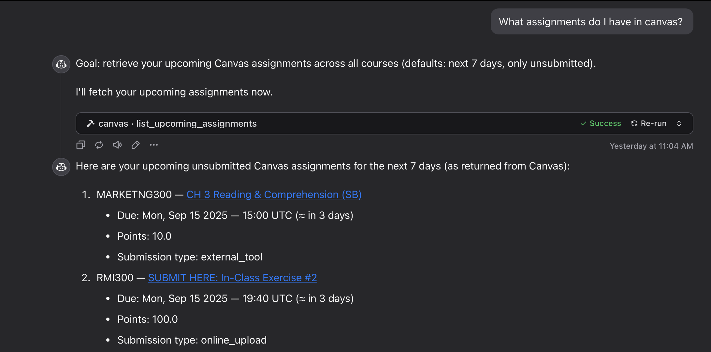

# Canvas MCP Server



## Overview

-   MCP server exposing student-focused Canvas LMS tools using `canvasapi` and `fastmcp`.
-   Transport: stdio (default). Configure via environment variables.

## Environment

-   `CANVAS_API_URL`: Base URL of your Canvas instance (e.g., `https://canvas.wisc.edu`).
-   `CANVAS_API_TOKEN`: Canvas access token for the student account.

## Installation

### Recommended (uvx)

Add this server to your MCP client configuration using `uvx` so dependencies are resolved automatically on launch (fill in placeholders):

```json
{
	"mcpServers": {
		"canvas-mcp": {
			"command": "uvx",
			"args": ["git+https://github.com/joshrad-dev/canvas-mcp"],
			"env": {
				"CANVAS_API_URL": "https://YOUR-SUBDOMAIN.instructure.com",
				"CANVAS_API_TOKEN": "YOUR_CANVAS_ACCESS_TOKEN"
			}
		}
	}
}
```

### Development

1. `git clone https://github.com/joshrad-dev/canvas-mcp && cd canvas-mcp`
2. Create and sync the environment using `uv`:
    - `uv venv`
    - `uv sync`
3. Update your MCP client config (fill in placeholders):

```json
{
	"mcpServers": {
		"canvas-mcp": {
			"command": "uv",
			"args": [
				"run",
				"--directory",
				"/absolute/path/to/canvas-mcp",
				"/path/to/canvas-mcp/main.py"
			],
			"env": {
				"CANVAS_API_URL": "https://YOUR-SUBDOMAIN.instructure.com",
				"CANVAS_API_TOKEN": "YOUR_CANVAS_ACCESS_TOKEN"
			}
		}
	}
}
```

## Tools

-   `health()`: Health check and env presence.
-   `get_current_user()`: Current user profile (id, name, email, etc.).
-   `list_my_courses(enrollment_state="active", include_concluded=False)`: List enrolled courses.
-   `list_course_assignments(course_id, bucket=None, search_term=None)`: List assignments for a course.
-   `get_assignment_details(course_id, assignment_id)`: Assignment details.
-   `get_my_submission(course_id, assignment_id)`: Current student submission status.
-   `list_upcoming_assignments(days=7, only_unsubmitted=True)`: Upcoming assignments across courses.
-   `get_my_course_grade(course_id)`: Course grade summary for the student.
-   `list_course_announcements(course_id, only_published=True)`: Course announcements.
